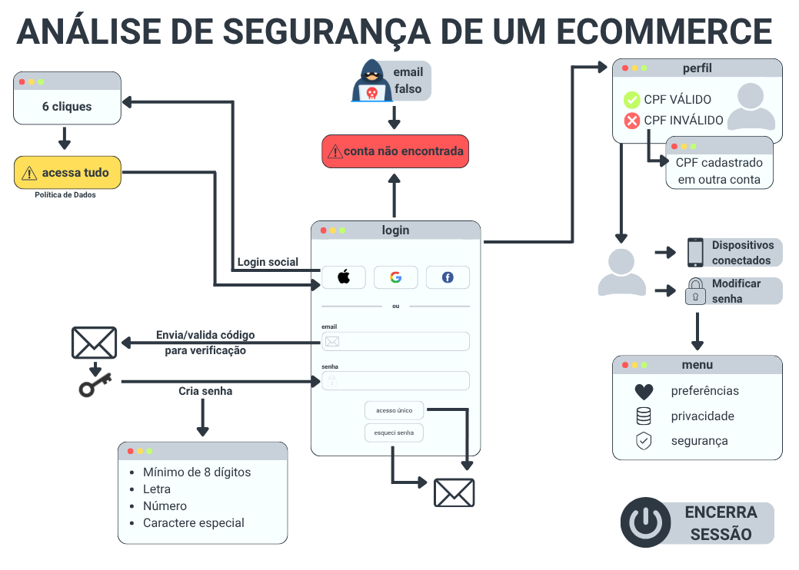
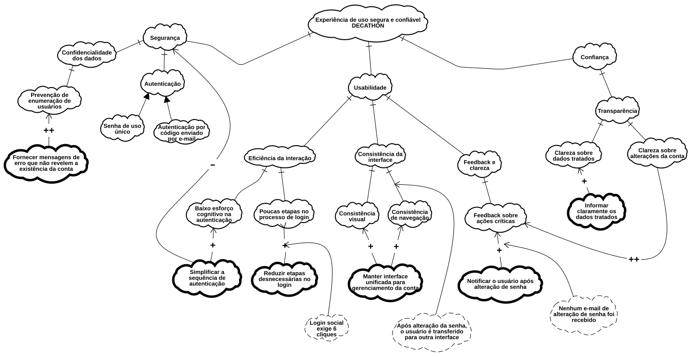

# Rich Picture

O **Rich Picture** é uma ferramenta de modelagem visual utilizada para representar, de forma rica e informal, um problema, processo ou sistema, incluindo seus elementos, atores, relações e conflitos. Sua principal vantagem é facilitar o entendimento compartilhado de uma situação complexa antes de partir para soluções técnicas, permitindo enxergar o "todo" de maneira mais intuitiva do que textos ou diagramas formais.

## [Objetivo da análise](#objetivo-da-análise)

Neste projeto, foram analisados os artefatos generalistas do sistema, e a partir dessa análise foi escolhido o processo de login e a segurança do usuário como foco para o desenvolvimento do Rich Picture. Com base no relatório de casos de teste realizado sobre esse artefato, foi possível identificar falhas e pontos de atenção relacionados à autenticação dos usuários, que serviram de base para a construção da representação visual.

**Figura 1:** Rich Picture



*Autor: [Mariana Ribeiro](https://github.com/marianagonzaga0)*

A construção do Rich Picture seguiu um processo iterativo. Inicialmente, foram feitos rascunhos à mão para organizar as ideias, os atores envolvidos e as relações entre os elementos do sistema. Em seguida, essa versão inicial foi refinada e formalizada utilizando a ferramenta Canva, resultando na representação final apresentada acima.

# NFR Framework

O **NFR Framework (Non-Functional Requirements Framework)** é uma abordagem orientada a objetivos utilizada para elicitar, analisar, especificar e avaliar Requisitos Não Funcionais (NFRs). O framework trabalha com **softgoals**, que representam preocupações de qualidade, e com suas interdependências, permitindo explicitar como diferentes decisões de projeto contribuem positiva ou negativamente para essas preocupações.

No presente trabalho, o NFR Framework foi aplicado ao **Fluxo A da plataforma de e-commerce da Decathlon Brasil**, com foco em **Login, Perfil de Usuário e Segurança**, enfatizando a relação entre **Segurança, Usabilidade, Privacidade e Confiança do Usuário**.

A análise foi realizada considerando os resultados obtidos durante a avaliação do fluxo de autenticação e gerenciamento da conta. O levantamento completo pode ser consultado no documento utilizado como evidência da análise:

[**Relatório de avaliação do Fluxo A - Decathlon**](sandbox:/mnt/data/teste%20-%20Decathlon.pdf)

## [Objetivo da análise](#objetivo-da-análise)

O objetivo da modelagem é identificar e representar as principais preocupações de qualidade relacionadas ao Fluxo A, observando não apenas os aspectos de segurança, mas também seus impactos sobre a **experiência do usuário**.

O modelo busca responder principalmente à seguinte questão:

> Como garantir uma experiência de uso segura e confiável sem comprometer a usabilidade, a clareza e a autonomia do usuário durante o acesso e gerenciamento de sua conta?

Essa abordagem considera que os requisitos não funcionais são interdependentes e que uma decisão de projeto pode contribuir positivamente para uma preocupação enquanto prejudica outra. O NFR Framework permite justamente representar essas relações por meio de **decomposições, operacionalizações e contribuições entre softgoals**.

## [Escopo](#escopo)

A análise está concentrada no seguinte fluxo:

- Login;
- Login social;
- Cadastro;
- Recuperação de acesso;
- Alteração de senha;
- Logout;
- Gerenciamento do perfil;
- Proteção das informações da conta;
- Privacidade e visibilidade dos dados.

O modelo foi delimitado para o **Fluxo A**, não abrangendo as demais funcionalidades do e-commerce, como busca de produtos, carrinho e pagamento.

## [Metodologia](#metodologia)

A construção do NFR Framework foi realizada a partir da observação do comportamento do sistema durante a execução dos cenários definidos para o Fluxo A.

Inicialmente, foram identificadas as principais **preocupações de qualidade** relacionadas à experiência de uso. Em seguida, essas preocupações foram refinadas em **NFRs mais específicos**, até alcançar soluções concretas representadas como **Operationalizations**.

Além disso, os resultados observados durante a avaliação foram representados como **Claims**, permitindo relacionar evidências observadas no sistema às preocupações de qualidade correspondentes.

A análise também considera as **interdependências entre os NFRs**, especialmente os conflitos entre Segurança e Usabilidade.

Segundo Singh e Tripathi (2012), preocupações abstratas de qualidade devem ser refinadas em requisitos não funcionais que sejam suficientemente claros, objetivos e testáveis. Os autores também destacam o uso de cenários para apoiar a avaliação dos NFRs. [**[1]**](#bibliografia)

**Figura 2:** NFR Framework do Fluxo A



*Autor: [Dylan Cavalcante](https://github.com/dylancavalcante)*

## Principais achados da avaliação

Os achados observados durante a avaliação serviram como base para a definição dos Claims e para o refinamento dos softgoals do NFR Framework.

**Tabela 1: Principais achados da avaliação do Fluxo A**

| **Achado observado** | **Categoria relacionada** | **Elemento do NFR Framework** | **Implicação para a análise** |
| --- | --- | --- | --- |
| O login social exigiu 6 cliques | Usabilidade | Poucas etapas no processo de login | Indica preocupação com a eficiência da interação e com o esforço necessário para autenticação. |
| Houve confirmação relacionada ao recebimento de e-mails promocionais durante o login social | Usabilidade / Privacidade | Autonomia do usuário | Indica possível mistura entre autenticação e decisão relacionada a comunicações promocionais. |
| Após o logout, o botão "Voltar" levou novamente à tela de login | Segurança | Logout efetivo / Gestão de sessão | Evidencia comportamento compatível com o encerramento da sessão no fluxo avaliado. |
| Após a alteração da senha, o usuário foi direcionado para outra interface | Usabilidade | Consistência da interface | Indica uma preocupação relacionada à continuidade e consistência da experiência. |
| A interface apresentada após a alteração da senha possuía dados diferentes dos encontrados no perfil convencional | Usabilidade / Privacidade | Consistência das informações | Indica possível inconsistência na apresentação e organização das informações da conta. |
| Nenhum e-mail de alteração de senha foi recebido | Segurança / Usabilidade | Feedback sobre ações críticas | Indica uma preocupação relacionada à comunicação de alterações importantes da conta. |
| O sistema rejeitou uma senha que já havia sido utilizada anteriormente | Segurança | Proteção contra reutilização de senha | Evidencia a existência de uma regra relacionada à proteção das credenciais. |

Os achados relativos ao login social estão registrados no relatório de avaliação. O comportamento do logout também foi registrado durante a execução do cenário correspondente. A alteração de senha, a mudança de interface e a ausência de notificação por e-mail foram observadas nas etapas finais da avaliação.

## Claims

Os **Claims** representam afirmações derivadas das observações realizadas durante a avaliação do sistema. Eles são utilizados como evidências para apoiar os softgoals e decisões representados no SIG.

Foram utilizados os seguintes Claims:

| **Claim** | **Softgoal relacionado** |
| --- | --- |
| Login social exige 6 cliques | Poucas etapas no processo de login |
| Após alteração da senha, o usuário é transferido para outra interface | Consistência da interface |
| A outra interface apresenta dados diferentes do perfil convencional | Consistência das informações |
| Nenhum e-mail de alteração de senha foi recebido | Feedback sobre ações críticas |

Os Claims acima foram derivados dos resultados observados durante a avaliação e não devem ser confundidos com os próprios requisitos não funcionais.

## Trade-offs identificados

Um dos principais objetivos da modelagem foi representar as relações de contribuição entre as preocupações de qualidade.

O principal trade-off identificado ocorre entre **Usabilidade e Segurança**.

A operacionalização:

**Simplificar a sequência de autenticação**

apresenta duas contribuições:

- **`+` para Usabilidade**, pois a redução da complexidade pode facilitar a interação;
- **`-` para Segurança**, pois uma simplificação excessiva pode reduzir barreiras de proteção.

Assim, o SIG representa:

```text
          Simplificar a sequência
               de autenticação
                    |
              +-----------+
              |           |
              v           v
         Usabilidade   Segurança
              +           -
```            

A intenção não é afirmar que simplificar a autenticação necessariamente compromete a segurança, mas explicitar o possível **trade-off entre redução do esforço do usuário e fortalecimento dos mecanismos de proteção**.


## Rastreabilidade dos resultados

A rastreabilidade entre a avaliação realizada e a modelagem NFR foi mantida por meio da associação entre **achados observados, Claims, softgoals e operacionalizações**.

O documento completo utilizado para a obtenção dos resultados está disponível abaixo:

[**Abrir Relatório de avaliação do Fluxo A - Decathlon**](sandbox:/mnt/data/teste%20-%20Decathlon.pdf)

O relatório contém os cenários relacionados à enumeração de usuários, login social, gestão de sessão, cadastro, recuperação de acesso, políticas de visibilidade de dados e alteração de informações sensíveis.

## Literatura utilizada

A construção do modelo foi baseada principalmente no NFR Framework proposto por Chung, Nixon, Yu e Mylopoulos e no conceito de refinamento de preocupações de qualidade em requisitos não funcionais verificáveis.

### Bibliografia

1. CHUNG, Lawrence; NIXON, Brian A.; YU, Eric; MYLOPOULOS, John. **Non-Functional Requirements in Software Engineering**. Boston: Kluwer Academic Publishers, 2000. Disponível em: [Springer](https://link.springer.com/book/10.1007/978-1-4615-5269-7).

2. SINGH, Pratima; TRIPATHI, Anil Kumar. **Treating NFR as First Grade for Its Testability**. *Journal of Software Engineering and Applications*, v. 5, p. 991-1000, 2012. [**PDF utilizado na análise**](sandbox:/mnt/data/Treating_NFR_as_First_Grade_for_Its_Testability.pdf).

3. O artigo de Singh e Tripathi destaca que os NFRs devem ser refinados a partir de preocupações abstratas de qualidade até chegar a especificações claras, objetivas e testáveis. O trabalho também apresenta cenários como uma forma de estruturar a análise e avaliação dos NFRs. [**[2]**](https://doi.org/10.4236/jsea.2012.512114)

## Histórico de versões

| **Versão** | **Data** | **Descrição** | **Autores** | **Revisor** |
| --- | --- | --- | --- | --- |
| 1.0 | 27/08/2026 | Elaboração inicial do NFR Framework para o Fluxo A | [Dylan Cavalcante](https://github.com/dylancavalcante) | A definir |
| 1.1 | 27/08/2026 | Elaboração inicial do Rich Picture | [Mariana Ribeiro](https://github.com/marianagonzaga0) | A definir |
