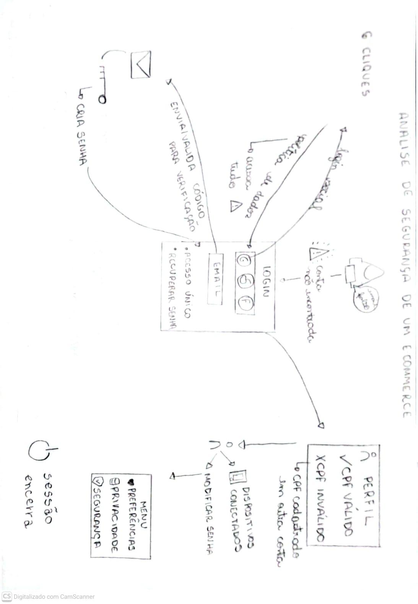

# Introdução

O objeto central deste estudo abrange o fluxo: Autenticação, Cadastro e Gestão de Perfil do Usuário do e-commerce da [Decatlhon Brasil](https://www.decathlon.com.br/?utm_id=446506642-1166583788952155&msclkid=091f92b84b35170e8da3f8341b2d1eb0&utm_source=bing&utm_medium=cpc&utm_campaign=br_ct-search_t-perf_nc-brand-nacional_ts-bra_f-cv_o-roas_pnl-ecom_bm-ish_xx-microsoft-ads_&utm_term=esporte%20decathlon&utm_content=yy-institucional-termos-aon_). O trabalho concentra-se na especificação, análise comportamental e modelagem de Requisitos Não-Funcionais(NRFs),com ênfase na relação entre Segurança, Usabilidade, Privacidade e Confiança do Usuário, representados visualmente através de artefatos estruturados que serão mostrados a seguir.

# Metodologia

A construção do estudo e pesquisa seguiu uma abordagem empírio/analítica dividida nas seguintes etapas:

**1. Elaboração de Casos de Teste:** definição prévia dos cenários de teste, critérios de aceitação, dados de entrada e resultados esperados, visando orientar a execução de validação do sistema e garantir a cobertura dos requisitos funcionais e não-funcionais.

**2. Engenharia Reversa & Avaliação Empírica:** mapeamento comportamental direto da plataforma em execução, inserindo entradas (dados válidos/inválidos, senhas incorretas consecutivas) para capturar respostas da aplicação, falhas de usabilidade e vulnerabilidade de segurança. Os resultados foram consolidados no [Relatório de Casos de Tese](Base/assets/relatorio-casos-de-teste.pdf).

**3. Modelagem Informal (Rich Picture):** elaboração visual do ecossistema observado para elicitar atores, interações e conflitos de interesse de forma intuitiva.

**4. Modelagem Formal de Requisitos Não-Funcionais (NFR Framework):** representação gráfica via Softgoal Interdependency Graph (SIG), decompondo metas de qualidade, operacionalizações, avaliações e identificando trade-offs.

# Ferramentas utilizadas

A seguir estão as ferramentas utilizadas para o desenvolvimento do foco 01:
- Execução dos Testes e Engenharia Reversa: Navegadores Web (Google Chrome/Mozila Firefox);
- Elaboração do Rich Picture: Desenhos analógicos (rasucho à mão) e Canva para diagrama vetorial final;
- Documentação e Modelagem NRF: website [DSM3](https://www.cin.ufpe.br/~jhcp/dsm3goals/index.html).

# Artefato 1: Rich Picture

O **Rich Picture** é uma ferramenta de modelagem visual utilizada para representar, de forma rica e informal, um problema, processo ou sistema, incluindo seus elementos, atores, relações e conflitos. Sua principal vantagem é facilitar o entendimento compartilhado de uma situação complexa antes de partir para soluções técnicas, permitindo enxergar o "todo" de maneira mais intuitiva do que textos ou diagramas formais.

## [Processo de Desenvolvimento:](#processo-de-desenvolvimento)
**1. Fase Analógica (Rascunho):** Mapeamento manual inicial, limites do sistema e artefatos de dados .

**2. Fase Digital (Refinamento):** Formalização visual dos elementos e ícones utilizando a ferramenta Canva.

**Figura 1:** Rascunho à mão



*Autoria: [Mariana Ribeiro](https://github.com/marianagonzaga0), [Rafaela Andrea](https://github.com/RadamesGuerra)*

**Figura 2:** Rich Picture 


*Autoria: [Mariana Ribeiro](https://github.com/marianagonzaga0), [Rafaela Andrea](https://github.com/RadamesGuerra), [Dylan Cavalcante](https://github.com/dylancavalcante), [Samuel Felipe](https://github.com/TerminaKng05)*


# Artefato 2: NFR Framework

O **NFR Framework (Non-Functional Requirements Framework)** é uma abordagem orientada a objetivos utilizada para elicitar, analisar, especificar e avaliar Requisitos Não Funcionais (NFRs). O framework trabalha com **softgoals**, que representam preocupações de qualidade, e com suas interdependências, permitindo explicitar como diferentes decisões de projeto contribuem positiva ou negativamente para essas preocupações.

## [Objetivo da análise](#objetivo-da-análise)

O objetivo da modelagem é identificar e representar as principais preocupações de qualidade relacionadas ao Fluxo A, observando não apenas os aspectos de segurança, mas também seus impactos sobre a **experiência do usuário**.

O modelo busca responder principalmente à seguinte questão:

> Como garantir uma experiência de uso segura e confiável sem comprometer a usabilidade, a clareza e a autonomia do usuário durante o acesso e gerenciamento de sua conta?

Essa abordagem considera que os requisitos não funcionais são interdependentes e que uma decisão de projeto pode contribuir positivamente para uma preocupação enquanto prejudica outra. O NFR Framework permite justamente representar essas relações por meio de **decomposições, operacionalizações e contribuições entre softgoals**.

## [Escopo e Delimitação](#escopo)

A análise está delimitada estritamente às interações do **Fluxo: Autenticação, Cadastro e Gestão de Perfil do Usuário**, contemplando as seguintes etapas:

* Login convencional e validação de e-mail;
* Login social (OAuth) e permissões;
* Cadastro manual e validação de CPF/OTP;
* Recuperação de acesso e senha;
* Autenticação *Passwordless* (Senha de acesso único);
* Encerramento de sessão (*Logout*) e gestão de cache;
* Gerenciamento do perfil em painel SSO;
* Proteção das informações de conta e alteração de credenciais;
* Privacidade, visibilidade de dados e exclusão de conta (LGPD).

O modelo foi delimitado para o referido fluxo, não abrangendo as demais funcionalidades do e-commerce, como busca de produtos, carrinho e pagamento.

## [Processo de desenvolvimento](#metodologia)

A construção do NFR Framework foi realizada a partir da observação do comportamento do sistema durante a execução dos cenários definidos para o Fluxo: Autenticação, Cadastro e Gestão de Perfil do Usuário.

Inicialmente, foram identificadas as principais **preocupações de qualidade** relacionadas à experiência de uso. Em seguida, essas preocupações foram refinadas em **NFRs mais específicos**, até alcançar soluções concretas representadas como **Operationalizations**.

Além disso, os resultados observados durante a avaliação foram representados como **Claims**, permitindo relacionar evidências observadas no sistema às preocupações de qualidade correspondentes.

A análise também considera as **interdependências entre os NFRs**, especialmente os conflitos entre Segurança e Usabilidade.

Segundo Singh e Tripathi (2012), preocupações abstratas de qualidade devem ser refinadas em requisitos não funcionais que sejam suficientemente claros, objetivos e testáveis. Os autores também destacam o uso de cenários para apoiar a avaliação dos NFRs. [**[1]**](#bibliografia)

**Figura 3:** NFR Framework do Fluxo A


*Autoria: [Dylan Cavalcante](https://github.com/dylancavalcante), [Mariana Ribeiro](https://github.com/marianagonzaga0), [Rafaela Andrea](https://github.com/RadamesGuerra) , [Samuel Felipe](https://github.com/TerminaKng05)*


## Principais achados da avaliação

Os achados observados durante a avaliação serviram como base para a definição dos Claims e para o refinamento dos softgoals do NFR Framework.

| **Achado observado** | **Categoria relacionada** | **Elemento do NFR Framework** | **Rastreabilidade** | **Implicação para a análise** |
| --- | --- | --- | --- | --- |
| O login social exigiu 6 cliques | Usabilidade | Poucas etapas no processo de login | [Imagem](https://imgur.com/a/JgQn1qQ) | Indica preocupação com a eficiência da interação e com o esforço necessário para autenticação. |
| Houve confirmação relacionada ao recebimento de e-mails promocionais durante o login social | Usabilidade / Privacidade | Autonomia do usuário | [Imagem](https://imgur.com/5w3RVPb) | Indica possível mistura entre autenticação e decisão relacionada a comunicações promocionais. |
| Após o logout, o botão "Voltar" levou novamente à tela de login | Segurança | Logout efetivo / Gestão de sessão | [Imagem](https://imgur.com/dORblEk) | Evidencia comportamento compatível com o encerramento da sessão no fluxo avaliado. |
| Após a alteração da senha, o usuário foi direcionado para outra interface | Usabilidade | Consistência da interface | [Imagem](https://imgur.com/0js0lAg) | Indica uma preocupação relacionada à continuidade e consistência da experiência. |
| A interface apresentada após a alteração da senha possuía dados diferentes dos encontrados no perfil convencional | Usabilidade / Privacidade | Consistência das informações | [Imagem](https://imgur.com/nqwk1Pe) | Indica possível inconsistência na apresentação e organização das informações da conta. |
| Nenhum e-mail de alteração de senha foi recebido | Segurança / Usabilidade | Feedback sobre ações críticas | [Imagem](https://imgur.com/rFbuVwS) | Indica uma preocupação relacionada à comunicação de alterações importantes da conta. |
| O sistema rejeitou uma senha que já havia sido utilizada anteriormente | Segurança | Proteção contra reutilização de senha | [Imagem](https://imgur.com/fPRp87t) | Evidencia a existência de uma regra relacionada à proteção das credenciais. |

Os achados relativos ao login social estão registrados no relatório de avaliação. O comportamento do logout também foi registrado durante a execução do cenário correspondente. A alteração de senha, a mudança de interface e a ausência de notificação por e-mail foram observadas nas etapas finais da avaliação.

## Claims

Os **Claims** representam afirmações derivadas das observações realizadas durante a avaliação do sistema. Eles são utilizados como evidências para apoiar os softgoals e decisões representados no SIG.

Foram utilizados os seguintes Claims:

| **Claim** | **Softgoal relacionado** |
| --- | --- |
| Login social exige 6 cliques | Poucas etapas no processo de login |
| Após alteração da senha, o usuário é transferido para outra interface | Consistência da interface |
| A outra interface apresenta dados diferentes do perfil convencional | Consistência das informações |
| Nenhum e-mail de alteração de senha foi recebido | Feedback sobre ações críticas |

Os Claims acima foram derivados dos resultados observados durante a avaliação e não devem ser confundidos com os próprios requisitos não funcionais.

## Trade-offs identificados

Um dos principais objetivos da modelagem foi representar as relações de contribuição entre as preocupações de qualidade.

O principal trade-off identificado ocorre entre **Usabilidade e Segurança**.

A operacionalização:

**Simplificar a sequência de autenticação**

apresenta duas contribuições:

- **`+` para Usabilidade**, pois a redução da complexidade pode facilitar a interação;
- **`-` para Segurança**, pois uma simplificação excessiva pode reduzir barreiras de proteção.

Assim, o SIG representa:

```text
          Simplificar a sequência
               de autenticação
                    |
              +-----------+
              |           |
              v           v
         Usabilidade   Segurança
              +           -
```            

A intenção não é afirmar que simplificar a autenticação necessariamente compromete a segurança, mas explicitar o possível **trade-off entre redução do esforço do usuário e fortalecimento dos mecanismos de proteção**.


## Rastreabilidade dos resultados

A rastreabilidade entre a avaliação realizada e a modelagem NFR foi mantida por meio da associação entre **achados observados, Claims, softgoals e operacionalizações**.

O documento completo utilizado para a obtenção dos resultados está disponível abaixo:

[**Abrir Relatório de Casos de Teste do Fluxo A - Decathlon**](Base/assets/relatorio-casos-de-teste.pdf ':ignore')

O relatório contém os cenários relacionados à enumeração de usuários, login social, gestão de sessão, cadastro, recuperação de acesso, políticas de visibilidade de dados e alteração de informações sensíveis.

## Literatura utilizada

A construção do modelo foi baseada principalmente no NFR Framework proposto por Chung, Nixon, Yu e Mylopoulos e no conceito de refinamento de preocupações de qualidade em requisitos não funcionais verificáveis.

## Tabela de Contribuições

| Nome do Membro | Contribuições no Foco I |
| :--- | :--- |
| [Dylan Cavalcante](https://github.com/dylancavalcante) | CoAutor do Grafo de Interdependência de Softgoals (SIG) e autor do NFR Framework; Coautor do Rich Picture. Participei na elaboração de casos de teste com o grupo e na consolidação dos resultados no formato de relatório, e na modelagem dos requisitos não-funcionais. |
| [Mariana Ribeiro](https://github.com/marianagonzaga0) | CoAutora do Rich Picture - rascunho e versão final; Coautora do NFR Framework. Participei da elaboração e execução dos casos de teste com o grupo e na elaboração do modelo visual do ecossistema. |
| [Rafaela Andrea](https://github.com/RadamesGuerra) | CoAutora do Rich Picture - rascunho e versão final; Coautora do NFR Framework. Participei na execução dos casos de teste, captura das respostas da aplicação na avaliação empírica e na modelagem de requisitos não-funcionais. |
| [Samuel Felipe](https://github.com/TerminaKng05) | Coautor do Rich Picture e Coautor da Estrutura NFR (NFR Framework). Participei da modelagem informal do ecossistema, identificando os elementos observados na avaliação empírica e da modelagem dos requisitos não-funcionais. |

### Bibliografia

1. CHUNG, Lawrence; NIXON, Brian A.; YU, Eric; MYLOPOULOS, John. **Non-Functional Requirements in Software Engineering**. Boston: Kluwer Academic Publishers, 2000. Disponível em: [Springer](https://link.springer.com/book/10.1007/978-1-4615-5269-7).

2. SINGH, Pratima; TRIPATHI, Anil Kumar. **Treating NFR as First Grade for Its Testability**. *Journal of Software Engineering and Applications*, v. 5, p. 991-1000, 2012. [**PDF utilizado na análise**](sandbox:/mnt/data/Treating_NFR_as_First_Grade_for_Its_Testability.pdf).

3. O artigo de Singh e Tripathi destaca que os NFRs devem ser refinados a partir de preocupações abstratas de qualidade até chegar a especificações claras, objetivas e testáveis. O trabalho também apresenta cenários como uma forma de estruturar a análise e avaliação dos NFRs. [**[2]**](https://doi.org/10.4236/jsea.2012.512114)

## Histórico de versões

| **Versão** | **Data** | **Descrição** | **Autores** | **Revisor** |
| --- | --- | --- | --- | --- |
| 1.0 | 27/08/2026 | Elaboração inicial do NFR Framework para o Fluxo A | [Dylan Cavalcante](https://github.com/dylancavalcante) | [Mariana Ribeiro](https://github.com/marianagonzaga0) |
| 1.1 | 27/08/2026 | Elaboração inicial do Rich Picture | [Mariana Ribeiro](https://github.com/marianagonzaga0) | [Samuel Felipe](https://github.com/TerminaKng05) |
| 1.2 | 27/08/2026 | Introdução e integração dos tópicos | [Mariana Ribeiro](https://github.com/marianagonzaga0) | [Dylan Cavalcante](https://github.com/dylancavalcante) |
| 1.3 | 27/08/2026 | Adiciona tabela de participação | [Dylan Cavalcante](https://github.com/dylancavalcante) | [Mariana Ribeiro](https://github.com/marianagonzaga0) |
| 1.4 | 27/08/2026 | Atualização Autores | [Mariana Ribeiro](https://github.com/marianagonzaga0) | [Dylan Cavalcante](https://github.com/dylancavalcante) |
| 1.5 | 28/08/2026 | Adição das ferramentas utilizadas | [Samuel Felipe](https://github.com/TerminaKng05) | [Dylan Cavalcante](https://github.com/dylancavalcante) |

