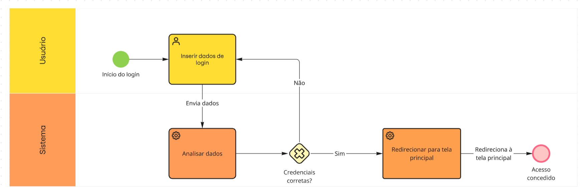
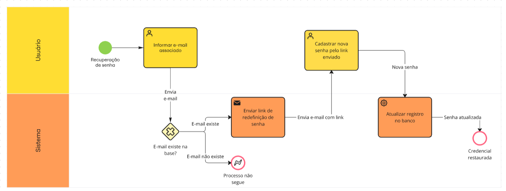

# Foco 02: Engenharia Reversa e BPMN

Este foco reúne o processo de engenharia reversa aplicado pela sub-equipe 01 e a modelagem BPMN relacionada ao fluxo analisado.

## Participantes

| Participantes |
| ------------- |
| Samuel Felipe |
| Rafaela |

## Escopo

A análise está concentrada no seguinte fluxo:

- Login;
- Login social;
- Cadastro;
- Recuperação de acesso;
- Alteração de senha;
- Logout;
- Gerenciamento do perfil;
- Proteção das infomações da conta;
- Privacidade e visibilidade dos dados.

## Metodologia

## Processo de engenharia reversa aplicada

## Modelagem BPMN

Modelo em notação BPMN (ferramenta [miro](https://miro.com/pt/)) do fluxo de login, alteração de senha e cadastro encontrado na engenharia reversa do subdomínio de conteúdo, integrando numa colaboração única os achados das três funcionalidades documentadas em Processo de Engenharia Reversa Aplicado.

#### Diagrama 1: Login

    

 Figura 1: Diagrama BPMN do fluxo de login. Autor: Samuel Felipe 

#### Diagrama 2: Alteração de senha

    

 Figura 2: Diagrama BPMN do fluxo de alteração de senha. Autor: Samuel Felipe 

#### Diagrama 3: Cadastro

    

 Figura 3: Diagrama BPMN do fluxo de cadastro. Autor: Samuel Felipe 

### Piscinas e Raias

Nos 3 diagramas, a modulação é divida em 2 raias:
    
- Usuário: representando quem interage com o sistema e ações envolvendo ele;
- Sistema: Sinaliza as operações que o sistema realiza durante a sequência de opreações necessárias para o objetivo do usuário;

Essa divisão ocorre devido ao tipo de modelagem em que o sistema segue.

### Fluxo modelado

1. **Login** - O usuário decide fazer login em sua conta, ele informa seus dados e o gateway "Credenciais corretas?" decide por onde segue o fluxo: se sim, redireciona o usuário a tela principal do sistema com o login efetuado; se não, retorna a etapa onde o usuário deve inserir seus dados novamente.
2. **Alteração da senha** - O usuário decide alterar a senha de sua conta, ele informa seu e-mail cadastrado e o gateway "E-mail existe na base de dados" decide por onde segue o fluxo: se sim, será enviado um link de redefinição de senha, onde usuário poderá alterá-la e manter seu cadastro atualizado; se não, o processo não seguirá, levando ao usuário reiniciar o fluxo.
3. **Cadastro** - O usuário decide criar um cadastro no sistema, ele informa seus dados e o gateway "Os dados são váldos?" decide por onde segue o fluxo: se sim, será registrado um novo usuário na base de dados e o cadastro será concluído; se não, retorna a etapa onde o usuário deve validar novamente seus dados de informação.

### Legenda de notação:

- **Gateway exclusivo (◇ com X):** decisão excludente — apenas um caminho é seguido;
- **Fluxo de Sequência:** vinculam as atividades na ordem em que são executadas no fluxo;

A lógica do diagrama é validada pelas notas de engenharia reversa do Foco_02 garantindo que seu desenvolvimento seguisse coerência com o foi desenvolvido.
  

## Referência Bibliográfica

- IBM. **O que é modelagem e notação de processos de negócios (BPMN)?** Disponível em: <https://www.ibm.com/br-pt/think/topics/bpmn>.
- SYDLE. **Notação BPMN: como aplicar para modelar processos?** Disponível em: <https://www.sydle.com/br/blog/notacao-bpmn-5ef510823130175de40cc4c2.
- MIRO. **Diagrama BPMN** Disponível em: <https://miro.com/pt/diagrama/o-que-e-bpmn/>.
- PROCESSMIND. Disponível em: <https://processmind.com/resources/docs/reference/download-the-bpmn-2-0-poster-in-your-language>.

## Histórico de versão

| Versão | Data | Descrição | Autor(es) | Revisor(es) |
| ------ | ---- | --------- | --------- | ----------- |
| 1.0 | 27/08/2026 | Criação da Página do Foco 02 da sub-equipe 01 | [Samuel Felipe](https://github.com/TerminaKng05) | ----- |
| 1.1 | 27/08/2026 | Adição das informações sobre a modelagem BPMN | [Samuel Felipe](https://github.com/TerminaKng05) | ----- |