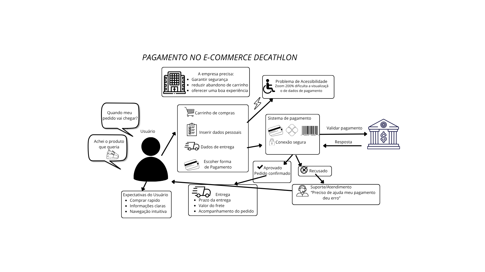

# Foco 1

## Rich Picture

Fonte: Elaborado pelos autores da Subequipe 3: Camile Barbosa Gonzaga de Oliveira, Lucas Oliveira Meireles, Letícia de Carvalho dos Santos, 2026.

Utilizou-se a técnica do Rich Picture para mapear o ecossistema do checkout no e-commerce da Decathlon. O objetivo foi visualizar a dinâmica entre os atores (Usuário, Empresa, Banco e Suporte) e destacar os gargalos que impactam a experiência do cliente e as metas do negócio.

Análise do Ponto Crítico: Acessibilidade no Checkout

* O Problema de Layout: Ao aplicar o recurso de Zoom em 200%, a interface do checkout sofre uma distorção grave de proporcionalidade: a área inferior destinada ao resumo do carrinho passa a ocupar a maior parte da tela, enquanto o formulário de pagamento fica espremido em uma faixa extremamente reduzida.
* Impacto no Usuário: A limitação do espaço útil dificulta a leitura, a digitação e a conferência dos dados do cartão ou boleto. Isso gera frustração, incerteza sobre o preenchimento correto e leva o cliente a acionar o Suporte/Atendimento ou abandonar a compra.
* Impacto no Negócio: Essa falha de renderização entra em atrito direto com os objetivos estratégicos da Decathlon de reduzir o abandono de carrinho e oferecer uma boa experiência, resultando em perda de conversão.
* Requisito Arquitetural: O problema evidencia a necessidade de refatorar a arquitetura do frontend (CSS/Layout Grid/Flexbox) para seguir as diretrizes de acessibilidade web (WCAG). A interface deve adaptar a hierarquia visual dinamicamente sob ampliação, garantindo que o formulário principal continue visível e utilizável sem ser soterrado por elementos secundários da página.

### Legenda do Rich Picture

| Elemento | Significado |
| --- | --- |
| Pessoa/figura humana | Usuário que realiza a compra e manifesta expectativas/dúvidas |
| Edifício/organização | Empresa/e-commerce e seus objetivos de negócio |
| Sistema/cartão/cadeado | Checkout e processamento seguro do pagamento |
| Instituição financeira | Componente externo que autoriza ou recusa a transação; o provedor específico não foi confirmado |
| Caminhão | Entrega, prazo, frete e rastreio após confirmação |
| Fones de atendimento | Suporte e recuperação após erro/recusa |
| Balão de fala | Expectativa, dúvida ou problema percebido pelo usuário |
| Seta contínua | Fluxo de informação, ação ou resposta |
| Linha pontilhada | Influência, problema ou requisito transversal |

## NFR Framework

O SIG foi construído a partir das preocupações identificadas no Rich Picture. O softgoal superior é **Pagamento simples, seguro e acessível**. Ele foi decomposto por AND em quatro preocupações que devem ser atendidas conjuntamente: **Segurança do pagamento**, **Usabilidade e clareza do checkout**, **Acessibilidade do checkout** e **Confiabilidade e recuperação** [1].

### Softgoals e refinamentos

| Softgoal | Refinamentos principais |
| --- | --- |
| Segurança do pagamento | Proteção/confidencialidade; validação confiável |
| Usabilidade e clareza do checkout | Sequência previsível; total, frete e desconto visíveis; feedback de cupom e pagamento |
| Acessibilidade do checkout | Teclado/foco visível; zoom 200% e reflow; rótulos e contraste |
| Confiabilidade e recuperação | Estado consistente; recuperação após falha; acompanhamento pós-confirmação |

### Operacionalizações selecionadas

| Softgoal | Operacionalização | Contribuição |
| --- | --- | --- |
| Segurança | Conexão segura e proteção dos dados | `++` |
| Segurança | Validar pagamento com instituição financeira/gateway | `++` |
| Usabilidade | Checkout em etapas: dados → entrega → pagamento → revisão | `++` |
| Usabilidade | Resumo persistente do pedido e total atualizado | `++` |
| Usabilidade | Validar cupom e explicar desconto/recusa | `++` |
| Acessibilidade | Navegação por teclado e foco visível | `++` |
| Acessibilidade | Layout responsivo em zoom 200% e reflow | `++` |
| Confiabilidade | Tratar pendente, aprovado, recusado e cancelado | `++` |
| Confiabilidade | Permitir corrigir dados ou trocar método | `++` |
| Confiabilidade | Confirmar pedido somente após aprovação e exibir rastreio | `++` |

### SIG

<b>Figura 2</b> — SIG do Fluxo C na notação do NFR Framework

Fonte: Elaborado pelos autores da Subequipe 3: Camile Barbosa Gonzaga de Oliveira, Lucas Oliveira Meireles, Letícia de Carvalho dos Santos, 2026.

Neste SIG, as nuvens representam softgoals e operacionalizações. As linhas com `AND` representam decomposição conjunta. `++` e `+` representam contribuições positivas forte e moderada. As linhas pontilhadas representam compromissos ou riscos.

### Claims e trade-offs

| Claim/risco | Softgoal relacionado | Contribuição ou relação |
| --- | --- | --- |
| Formulário de pagamento fica espremido em zoom de 200% | Acessibilidade — zoom/reflow | Negativa; achado exploratório a validar |
| Resumo persistente pode ocupar espaço em zoom elevado | Acessibilidade e usabilidade | Compromisso; reorganizar sem remover a conferência |
| Verificação antifraude pode aumentar fricção | Segurança e usabilidade | Compromisso; equilibrar proteção e esforço |
| IA de apoio pode receber dados sensíveis indevidamente | Segurança e recuperação | Risco; limitar IA a orientação sem dados de cartão/senha |

### Relação com o Rich Picture e rastreabilidade

O Rich Picture identifica atores, expectativas, problemas e relações. O SIG transforma as preocupações de qualidade encontradas nesse contexto em softgoals, refinamentos e operacionalizações. A rastreabilidade utilizada é:

**observação do checkout → problema/expectativa no Rich Picture → softgoal → refinamento → operacionalização → claim ou evidência → decisão de projeto.**

## Referências

[1]: https://www.ee.columbia.edu/~wa2171/MULIC/AndreopoulosCSITeA.pdf "Referência acadêmica sobre o NFR Framework"

## Histórico de versões

| Versão | Data | Descrição | Autores | Revisor | Observações de Revisão |
| --- | --- | --- | --- | --- | ---- |
| 1.0 | 27/08/2026 | Criação do Rich Picture | Letícia de Carvalho dos Santos | Lucas Oliveira Meireles | Revisão da imagem, revisão dos textos que acompanham a imagem, notada falta de legenda adicional |
| 1.1 | 27/08/2026 | Inclusão do SIG, claims e rastreabilidade; Legenda do Rich Picture | Lucas Oliveira Meireles | A preencher | A preencher |
