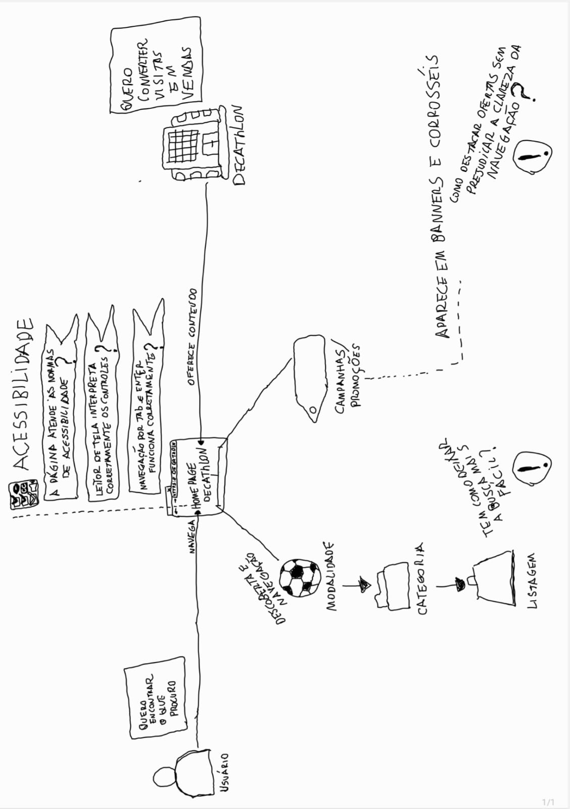

# Rich Picture

<b>Figura 1</b> - Rich Picture do subdomínio Projeto Comércio Eletrônico

  

Fonte: Elaborado pelos autores (Diassis Bezerra Nascimento, Nayra Silva Nery e Uires Carlos de Oliveira), 2026.

## Descrição

O Rich Picture representa o subdomínio de navegação e descoberta de conteúdo da plataforma de comércio eletrônico da Decathlon, ilustrando a relação entre o usuário, a homepage do site e a própria empresa. O usuário é representado com a necessidade central de encontrar o que procura, interagindo com a homepage por meio da navegação, enquanto a Decathlon utiliza essa mesma página para oferecer conteúdo com o objetivo de converter visitas em vendas.

A partir da homepage, dois fluxos de descoberta são destacados. O primeiro está relacionado à navegação por modalidade, categoria e listagem de produtos, evidenciando a hierarquia de busca disponível ao usuário. O segundo está relacionado às campanhas e promoções, que aparecem em banners e carrosséis na própria página inicial.

O artefato também evidencia preocupações transversais de qualidade, representadas na forma de questionamentos críticos levantados pela equipe, tais como:

- aderência da página às normas de acessibilidade;
- correta interpretação dos controles por leitores de tela;
- funcionalidade da navegação via teclado, usando Tab e Enter;
- facilidade de busca para o usuário;
- equilíbrio entre destacar ofertas promocionais e preservar a clareza da navegação.

Esses pontos sinalizam requisitos não funcionais, principalmente relacionados à usabilidade e à acessibilidade, que posteriormente fundamentaram a construção do SIG na notação do NFR Framework.

## Rastreabilidade

O Rich Picture foi utilizado como ponto de partida para a identificação das preocupações refinadas no [NFR Framework da Sub-equipe 02](/Base/subgrupo2/nfr_framework.md).

## Histórico de versões

| Versão | Data | Descrição | Autores | Revisor |
| --- | --- | --- | --- | --- |
| 1.0 | 27/08/2026 | Documentação do Rich Picture da Sub-equipe 02 | Diassis Bezerra Nascimento | A definir |
